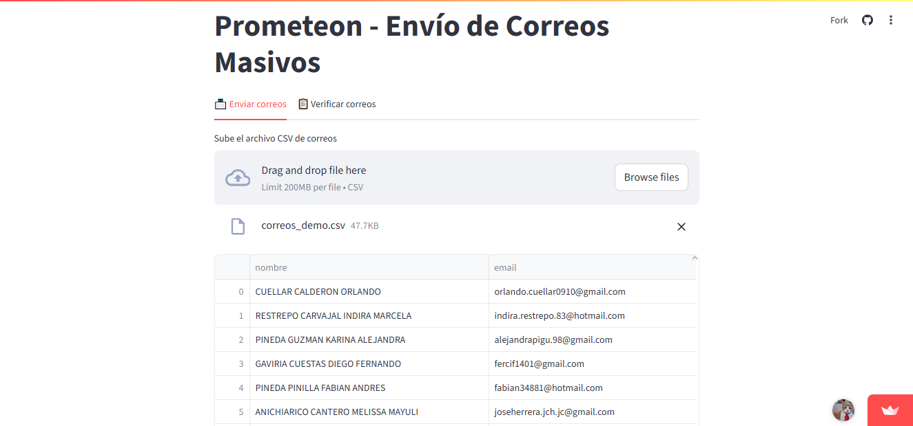
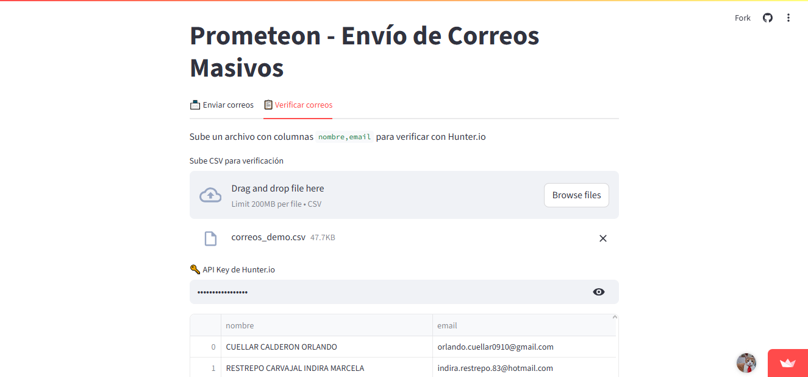

# Prometeon-Mailer 📧

**Prometeon-Mailer** es una aplicación desarrollada por [PrometeonDev](https://prometeondev.com) para automatizar el proceso de envío y validación de correos electrónicos en campañas publicitarias. Está construida con [Streamlit](https://streamlit.io/) y permite:

- 📨 Enviar hasta más de 50 correos al día usando plantillas HTML personalizadas.
- ✅ Verificar correos electrónicos mediante [Mailboxlayer](https://mailboxlayer.com/).
- 📂 Controlar listas de enviados y desuscritos automáticamente.
- 🔒 Ejecutarse localmente o en la nube (ej. [streamlit.app](https://prometeon-mailer.streamlit.app)).

---

## 🚀 Acceso rápido

🌐 Aplicación en vivo:  
👉 [https://prometeon-mailer.streamlit.app](https://prometeon-mailer.streamlit.app)

---

## 🧰 Tecnologías utilizadas

- Python 3.11
- Streamlit
- Pandas
- Mailboxlayer API
- HTML Templates
- SMTP (Hostinger)

---

## 🖼️ Capturas de pantalla

<p align="center">
  
  
</p>

---

## ⚙️ Instalación local

1. Clona este repositorio:

```bash
git clone https://github.com/sebastiansierra15/prometeon-mailer.git
cd prometeo-mailer
```

2. Crea un entorno virtual e instala dependencias:

```bash
python -m venv venv
source venv/bin/activate  # o .\venv\Scripts\activate en Windows
pip install -r requirements.txt
```

3. Crea un archivo `.env` con las siguientes variables:

```env
SMTP_SERVER=smtp.tu-dominio.com
SMTP_PORT=587
SMTP_USER=usuario@tudominio.com
SMTP_PASS=contraseña
FIRMA_NOMBRE=Tu Nombre
WHATSAPP_URL=https://wa.me/57XXXXXXXXX
CALENDLY_URL=https://calendly.com/tunombre
```

4. Ejecuta la aplicación:

```bash
streamlit run app.py
```

---

## 📋 Estructura del proyecto

```
sebastiansierra15-prometeon-mailer/
├── app.py                      # Interfaz principal de Streamlit
├── correo_utils.py            # Función de envío de correos
├── verificar_utils.py         # Función de validación con Mailboxlayer
├── plantilla_prometeon_email.html  # Template HTML del email
├── .env                       # Variables sensibles (no se sube a Git)
└── requirements.txt
```

---

## 📬 Cómo usar

### Enviar correos

1. Sube un archivo `.csv` con las columnas: `nombre,email`.
2. Opcionalmente, sube listas previas de `enviados` y `bajas`.
3. Haz clic en **Enviar correos**.

### Verificar correos

1. Sube un `.csv` con columnas `nombre,email`.
2. Introduce tu API Key de Mailboxlayer.
3. Presiona **Verificar correos**.

---

## ⚠️ Consideraciones

- Se recomienda no enviar más de 50 correos por día para evitar bloqueos por spam.
- Usa siempre una cuenta SMTP autorizada (como Hostinger con SPF/DKIM bien configurado).
- Asegúrate de respetar las normas legales de envío de correos (Ley Habeas Data en Colombia, CAN-SPAM en EE.UU.).
- La aplicación requiere una **contraseña de acceso** (desde el panel lateral) para ejecutar acciones sensibles como el envío o la verificación de correos.
- Esta clave está definida como `SECRET_KEY` en el archivo `.env`, por lo que la lógica de seguridad y autenticación está unificada.

---

## 📄 Licencia

Este proyecto está licenciado bajo la **Licencia MIT**, lo que significa que puedes usarlo, modificarlo y distribuirlo libremente, siempre y cuando conserves los créditos del autor.

---

## 👨‍💻 Autor y empresa

Este software ha sido desarrollado por **Sebastián Sierra** para la empresa **[PrometeonDev](https://prometeondev.com)**, especializada en soluciones de desarrollo web y automatización para negocios locales.

- [GitHub](https://github.com/SebastianSierra15)
- [LinkedIn](https://www.linkedin.com/in/sebastian-sierra-417358263/)
- 📧 sebsirra13@gmail.com

---

## 🤝 Contribuciones

Si deseas colaborar, proponer mejoras o reportar bugs, no dudes en abrir un *Issue* o un *Pull Request*.
